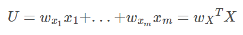
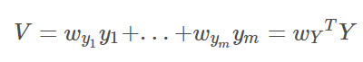
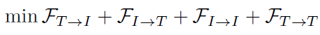
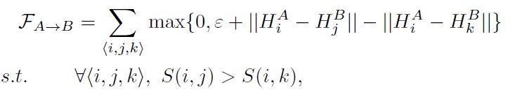

# 软件工程中的人工智能报告

第 5 组   钟展辉

我们小组展示的论文题目为：Deep collaborative embedding for social image understanding ，即：用深度协同嵌入来理解社交网络图片。该论文发表于 2019 年的 IEEE TRANSACTIONS ON PATTERN ANALYSIS AND MACHINE INTELLIGENCE会议上，下面是对该论文的详细分析和思考总结。

## 一、背景介绍

### 1.1 论文主要研究的问题

论文主要研究的是社交网络图片理解任务，即如何从大量的包含弱监督上下文信息的社交网络图片中学习出图片及标签的嵌入，然后应用到多种图片理解任务中，比如社交网络图片标签细化和标签分配任务、基于内容的图像检索任务、基于标签的图像检索任务、标签扩展任务等。本文主要以下围绕四种任务进行：

- 图片标注（Image Tagging）
- 基于内容的图像检索（Content-Based Image Retrieval）
- 基于标签的图像检索（Tag-Based Image Retrieval）
- 标签扩展（Tag Expansion）

### 1.2 这项研究具有的意义

近年来随着数字图像技术的发展和社交网络媒体的盛行，社交网络图片（community-contributed images）的数量大量增长，这些社交网络图片不同于普通的图片，它们包含了丰富的上下文信息，比如说用户所提供的图片标签，这些标签在一定程度上描述了对应图片的语义内容，有助于提高图片理解任务的效果。本文的研究将图片自身的空间信息及其在社交网络环境中的上下文信息联合起来，学习出更有代表性的嵌入，这些嵌入可以应用同时应用在多个不同的图片理解任务中，且实验证明效果很好。

### 1.3 论文的创新点

本文主要创新点如下：

- 提出了一个深度协同嵌入网络（deep collaborative embedding framework），可应用于多个图片理解任务中，就是说网络学习出来的嵌入，可以同时用于执行多个不同的图片理解任务。
- 将图片的弱监督信息、语义结构信息、视觉结构信息协同训练，嵌入到图片和标签的共同潜在语义空间（common latent space）中。
- 提出了解决out-of-sample问题的策略，即将新的图片和标签嵌入到潜在语义空间中。

## 二、相关工作

### 2.1 针对该研究问题，已经提出的解决方案

此前已经有多个将图片的视觉特征信息和标签信息嵌入到共同空间中的方法，它们主要是基于典型相关分析（Canonical Correlation Analysis）方法，这些方法仅仅只是研究了图片和标签之间的直接关联。

典型相关分析方法（CCA）可以探索两个向量之间的关联关系，这两个向量来自于一个相同的个体。

> 1、**非典型相关分析**即经典的相关分析，要研究两个向量x=[x1, x2, x3]和y=[y1, y2, y3]间的相关性，就是要得到一个x与y的协方差矩阵u=cov(X,Y)，矩阵中的每一个值uij表示的就是x的第i维特征xi和y的第j维特征yj之间的相关性。之后的相关性研究工作就是要基于这个矩阵展开。这样做的一个弊端就是，只考虑了xi和yj单个维度的相关性，没有考虑X和Y自己内部之间的相关性。而且协方差矩阵有m x n个值，使问题变得复杂。
>
> 2、**典型相关分析**则不是这样，它从总体上把握了两组变量之间的相关程度。比如CCA用于探索一张图片的视觉特征X=[x1, x2, x3]和标签特征Y=[y1, y2, y3]之间的关联关系时，用两个典型变量U和V来分别表示两组变量。他们分别是X和Y的线性组合（有很多种组合方式，即很多组U、V）
>
> 
>
> 
>
> 然后再求U、V之间的相关系数 ρ(U, V)，CCA的目的就是，找到U、V相关系数最大的那组典型变量，即找到那组X和Y的线性组合。因此，CCA的实质就是用典型变量（原变量的线性组合）来代表原变量，用它们之间的相关性ρ(U, V)来反映原变量的相关性。

### 2.2 当前研究存在的问题

此前的基于CCA方法来将图片视觉特征和标签特征嵌入到共同空间中，它们只能探索图片的视觉信息与标签之间的相关性，没有探索视觉信息与视觉信息之间的相关性，也没有探索标签与标签之间的相关性，因此只能处理图片标注任务，无法同时处理基于内容的图像检索任务、基于标签的图像检索任务、标签扩展任务等任务。

而本文所提出的网络不仅能够探索图片的视觉信息与标签之间的相关性，也能探索视觉信息与视觉信息之间、标签与标签之间的相关性，因此能够同时处理上诉四个图片理解任务。

## 三、 方法/框架/算法

本文算法名为Deep Collaborative Embedding，利用矩阵分解和深度卷积神经网络来将图片的视觉信息和标签信息嵌入到同一个潜在空间中，利用这个嵌入空间可以同时进行四个图片理解任务。

上图为本文DCE模型框架示意图，从facebook等社交网络媒体获取图片和标签数据（Social Images with Tags），输入到DCE模型中，将图片和标签嵌入到共同潜在空间（Embedding Space）中，然后进行四个图片理解任务（Image Understanding Tasks）。

### 3.1 预备知识 Preliminaries

- n张社交图片**X** :

  总共有c个标签：

  标签矩阵 **Y **=    ，矩阵尺寸为 n x c，Yij=1 代表图片 xi 图片与标签 tj 相关，Yij=0 代表无关。

- 由于社交图片的标签都是用户标记的，有可能有标记错误、标记遗漏等原因导致的标签矩阵Y有噪声问题。本文算法会学习得到一个尺寸相同的精炼的01矩阵 **F** ，解决标签噪声问题。

- 矩阵 **S** 代表图像间的相似性，矩阵 **C** 代表标签间的相似性。

- 使用矩阵分解方法（Matrix Factorization）将 **F** 分解成矩阵 和 

- 用Frobenius norm来度量分解的矩阵分解带来的误差，并加入正则化项避免过拟合

> Frobenius norm：矩阵A的Frobenius范数定义为矩阵A各项元素的绝对值平方的总和
>
> L2正则化就是在loss的计算中加上权重参数的平方和，惩罚参数过多或者过大，避免模型更加复杂，可以防止过拟合。

### 3.2 基本方法 Basic Formulation

几个矩阵之间的关系图如下所示，其中Y去除噪声得到F，F矩阵分解得到U和V，S=U[^T]U，C=V[^T]V ：

本文DCE模型的目标函数为：

L 是损失函数，omiga是正则化项，用于防止过拟合。函数R用于将视觉结构（visual structure）和文本结构（textual structure）结合起来：

为了解决标签噪声问题、将标签矩阵Y精炼成矩阵F，引入F与Y之间的L1正则化：

则模型优化公式可化为：

模型将图像的视觉信息和标签的文本信息联合起来一起训练，最终嵌入到共同的嵌入空间中。由于引入了精炼标签矩阵F，模型对标签噪声有鲁棒性。

模型训练得到矩阵U和V，可以计算得到两个相似性矩阵S和C：

 代表图像间的相似性

 代表标签间的相似性

模型训练完毕，得到矩阵F、S、C后就可以做image tagging, TBIR, CBIR and tag expansion等任务了。

但是仍未解决获取新图像和新标签的embedding的问题，为此提出了下面的方法。

### 3.3 新图片嵌入 

DCE网络用预训练模型CNN提取图片特征：假设CNN有 L 层，提取出来的特征为d维的hL(X)，则再经过一个权值矩阵的映射得到图片特征，因此图片数据集的特征提取公式为：

网络同时训练W,F,V，则训练完后对于新图片x，可以这样计算它的特征：

### 3.4 新标签嵌入

DCE网络用word2vector网络（预训练的skip-gram模型）提取标签特征：学习一个映射函数g，将tag映射到一个dt维特征向量：

再经过一个权值矩阵映射得到标签特征

网络训练学习到矩阵T后，可以这样计算新标签的特征：

### 3.5 目标函数 The Objective Function

将上述U、V矩阵的公式再带入模型目标函数中：

omiga还是正则化项，防止过拟合。

### 3.6 最优化 OPTIMIZATION

loss函数L选择最小平方差（least square loss）

对于矩阵来说就是矩阵相减后求F-范数，F-范数即矩阵各项元素的绝对值平方的总和。则目标函数又化为：

omiga(theta)的正则化类似于CNN网络中的dropout和BN，而矩阵W、T的正则化计算则还是用F-范数。

优化过程采用交替更新方法：

（1）CNN是预训练模型，固定CNN，求出并更新F、W、T

（2）用学习到的F、W、T对CNN进行fine-tuned

#### 3.6.1 矩阵T的更新方法 Solution for T

固定矩阵F、U，计算T的梯度并更新：

#### 3.6.2 矩阵W的更新方法 Solution forW

固定矩阵F、V，计算W的梯度并更新：

#### 3.6.3 矩阵F的更新方法 Solution for F

固定矩阵U、V，更新F，矩阵F的优化问题如下：

由于F是01矩阵，元素值是离散、非负的，需要引入一个辅助矩阵

其实就是取值从{0,1}变成{-1,1}而已。

重写优化目标：

其中

由,得

式子左右两边计算结果是相同的，都是取值{0, 2}，将L1 norm换成F-norm应该是因为更好求导。

#### 3.6.4 模型训练伪代码

### 3.7 具体实现细节

#### 3.7.1 Deep Neural Network

提取图片视觉特征的CNN用的是在ImageNet 上预训练出来的AlexNet，图像经过AlexNet得到一个1000-dim的向量，再接一个全连接层得到一个embedding。而神经网络的正则化，就是使用dropout而已。

#### 3.7.2 Image Similarity

图片之间的相似性矩阵S，既包含图片之间视觉层面的相似性Sv，又包含图片之间语义层面的相似性St，通过以下优化函数同时获得这两种相似性

分别学习图片visual view和textual view特征的同时拉近它们两者的距离，然后还加入正则化项防止过拟合。

最后再将这两个矩阵综合起来得到图像相似性矩阵  

#### 3.7.3 Tag Correlation

从local 和 global两个层面上寻找tag之间的相似性。

- local correlation相对准确，但是依赖于训练数据，本文使用非负稀疏重建方法（nonnegative sparse reconstruction）获取local correlation；
- global correlation更通用，独立于训练数据，但是不够准确。本文使用基于共现的方法（co-occurrence-based method ）获取global correlation。

然后综合起来得到tag相似性矩阵  

## 四、实验

实验部分总共做了以下四个任务：

- 图片标注（Image Tagging）
- 基于标签的图像检索（Tag-Based Image Retrieval）
- 基于内容的图像检索（Content-Based Image Retrieval）
- 标签扩展（Tag Expansion）

### 4.1 Datasets

MIRFlickr 和 NUS-WIDE

MIRFlickr：25,000 images, 1,386 user-provided tags, 38 concepts。去除出现次数低于50次的tag，最后剩下457个tags和18个concepts。

NUS-WIDE：269,648 images,  5,018 tags。去除出现次数低于125次的tag，最后剩下3,137个tags和81个concepts。

> concepts相当于数据集给出的图片ground-true label
>
> tags是用户标注的label，是包含噪声的。

### 4.2 Protocols

将数据集划分为learning data和testing data两部分。前者10,000张images，后者取剩下的images。保证learning data里包含所有labels。为了排除随机割分数据集的影响，重复实验5次，效果取平均。

参数设置：

- space dimension r ，用linear search方法调整，设为50。
- alpha, beta,gamma，用grid-search方法从下面数值中调整最好的参数组合
- lambda1=lambda2=0.005，经验调参

### 4.3 图片标注 Image Tagging

评估指标：**mean MicroAUC, mean MacroAUC and mean F1**

mean对应的是刚才说的5次实验，结果取平均。

> F1值是精确率和召回率的调和均值   F1=2PR/(P+R)
>
> TPR：在所有实际为Positive 的样本中，被正确地判断为Positive 的比率（与Recall
> 相同）。TPR=TP/(TP+FN)
> FPR：在所有实际为Negative 的样本中，被错误地判断为Positive 的比率。
> FPR=FP/(FP+TN)。
> 可见应该是TPR 越高越好，FPR 越低越好.
>
> 以TPR为y轴，FPR为x轴，调整阈值从0到1，画ROC曲线，曲线下面的面积为AUC值，AUC值越大说明模型效果越好。
>
> MicroAUC直接计算所有类别的指标，受小类效果影响小
>
> MacroAUC先分别计算各类的指标，再取平均。受小类效果影响大

Recall指标：标记正确的标签总数/数据集的标签总数

上述多个指标的结果对比中，DCE模型的结果是最好的，证明了DCE模型的有效性。

### 4.4 基于标签的图像检索 Tag-Based Image Retrieval

根据给出的一个标签来检索相关的图片。

评估指标：

Mean Average Precision (MAP) over concepts is obtained by averaging AP over all concepts.

> 

实验结果：

### 4.5 基于内容的图像检索 Content-Based Image Retrieval

DCE模型在学习到图片的latent representations后，就可以根据latent representations距离来判断图片间的相似性，进而进行基于图片内容的图像检索任务。

评估指标：NDCG@k

> **累计增益（CG）**：搜素结果相关性分数的总和,没有考虑到位置的因素。
>
> **折损累计增益（DCG）**：每一个搜索结果的相关性分数除以一个折损值，然后再求总和，位置越靠后折损值越大，目的是让排名靠前的结果对评估指标影响更大。
>
> 
>
> **归一化折损累计增益（NDCG）**：不同检索词的搜索结果数不同，为了能够进行比较，要做归一化
>
> 
>
> 其中IDCGp为理性情况下最大的DCG值。
>
> 参考<https://www.cnblogs.com/by-dream/p/9403984.html>

DCE效果比其他模型要好，可能是它在提取latent feature的过程中不仅利用了图片本身的视觉信息，还利用到了图像标签文本的语义信息。

### 4.6 Tag Expansion

一个图片的tag可能不够全面详细，可以通过tag-to-tag retrieval来给图片扩充tag信息。

用user study来评估tag expansion的效果。

25个学生，5个老师

much better, better，worse 分别给分 3, 2, 1

可见本文DCE模型分数最高。

## 五、结论

总的来说，本文工作是在社交网络图片理解任务上，提出了Deep Collaborative Embedding 模型。在一个模型上同时实现了端到端学习（end-to-end learning）和协同因子分析（collaborative factor analysis）。从标签矩阵中学习精炼矩阵F（refined matrix）以更好的学习社交网络图片的语义信息。此外还提出了处理out-of-sample问题的方法。本文DCE模型可适用于图片标注（Image Tagging）、基于内容的图像检索（Content-Based Image Retrieval）、基于标签的图像检索（Tag-Based Image Retrieval）、标签扩展（Tag Expansion）等任务。实验结果证明了DCE模型的有效性，达到了SOTA效果。

## 六、我的观点/思考

我此前有做过图像检索任务、跨模态检索任务（文本搜图像、图像搜文本）、视频检索任务，之所以选取这篇论文，也是以为可以从中借鉴到一些思想。但是结果令人十分失望，甚至让我感觉它能投中，简直匪夷所思。它的缺点有很多：

1. 尽管这是一篇2019年的文章，它使用的方法却是十分古老的，它的基础仍然是传统的矩阵运算、矩阵因子分解、矩阵求导，文章所强调的“Deep”，只不过是引入了AlexNet来提取图片的视觉特征，仿佛是发表于2016年的文章一样。可能这篇文章很早之前就写完了，只是一直投一直不中，直到被期刊接收了，而在此期间，本文已经落后于领域的发展了。
2. 虽然本文洋洋得意的宣称可以把图片的视觉信息和标签的文本信息嵌入到同一个潜在空间中，但实际上这已经是跨模态检索领域的常规操作，而且能够同时处理多个图片理解任务，比如文中的四个任务，已经是烂大街，随便挑篇近年的文章，改一改模型，就可以实现，而本文却把这一点列为贡献点，让人不禁惊叹，北京申奥成功！神州沸腾了！
3. 本文模型十分复杂，不仅包括了多个关键矩阵和矩阵分解，模型训练还采用了交替训练方法，最优化过程也很复杂。事实上这篇文章内容太多，写的十分凌乱，而且缺乏部分关键步骤，同时也没有开源代码，所以本文实际上是难以借鉴的。
4. 虽然本文的实验部分工作量很大，但实验效果其实相当差，比如说本文DCE模型在基于标签的图像检索任务中，在数据集MIRFlickr上的实验结果mAP=0.41，它跟其他算法做对比，并表示自己是效果最好的。然而在近年来的诸多文章里，这个指标已经被刷到了mAP=0.8，而且模型的学习方法也更简洁易懂。

我回顾了之前看过的一篇ECCV2018的有关跨模态检索的论文“Attention-aware Deep Adversarial Hashing for
Cross-Modal Retrieval”，他同样也是用的MIRFlickr和NUS-WIDE数据集，同样的数据集，人家简洁了当的讲是跨模态检索任务，而本文却强调是社交图片理解任务，在社交上下文信息的角度大书特书，水了不知道多少字数，而且你2019的文章，实验效果比人家2018的还差那么多。下面简单讲解这篇2018的论文的核心优化目标，cross-modal retrieval loss：，进行的是多任务联合训练，同时优化多个loss，分别是文本搜图片、图片搜文本、图片搜图片、文本搜文本，其中每个loss的设定为：

以文本搜图片为例子，他用的是triple ranking loss，通过优化上述的loss，就能够拉近相匹配的图片特征和文本特征之间的欧式距离，拉远不相匹配的图片特征和文本特征之间的欧式距离。其他任务loss原理类似。其中图片特征用VGGNet提取，文本特征用词袋+word2vec提取。这样一来，模型结构和训练流程简单，直接就达到将图片和文本嵌入到同一个潜在空间的效果，且容易复现、效果也是确确实实的。

## 七、阅读过程中遇到的问题

由于本文采用的是基于矩阵的方法，所以会有out-of-sample问题。由于我之前一接触检索任务开始，看的论文就已经是新近的深度学习方法了，所以对矩阵方法基本没有了解过，因此在看到文章中的out-of-sample问题时感到十分困惑，因为一般的深度学习模型，都是可以处理新样本的，这是理所当然的事情，不然怎么能在全是新样本的测试集上判断效果呢？后来重复阅读本文，再网上查询相关知识后，才知道本文是基于矩阵的方法来学习图片和标签的特征的，就是说它在训练集上训练，训练完毕后就得到了两个矩阵，分别对应图像和标签的特征，类似于word2vec的预训练矩阵一样，只能提取词库已有单词的词向量，不能提取未出现过的单词的词向量。因此，本文为了解决out-of-sample问题，又引入了新的矩阵，导致模型更加繁杂，优化过程有更多的矩阵求导，也更加复杂。

总的来说，研究完这篇论文之后，收获很少，大概就是了解了如何基于矩阵方法做检索任务、学习了一些检索任务的指标等等。此外我得到的教训是，看论文不能直接就从头看到尾，应该先看清楚abstract和introduction，思考清楚文章是否有借鉴意义，然后在仔细研究文章算法，而不是像这次一样，直接就从头看到尾，然后再思考，此时发现文章没有借鉴意义，也已经太晚了。