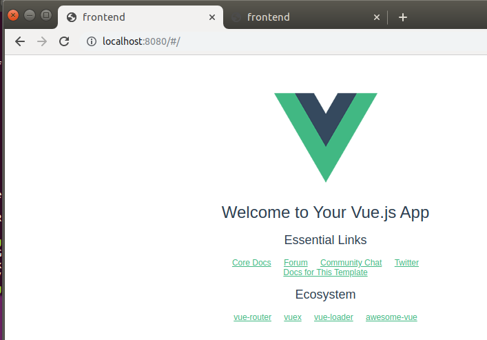
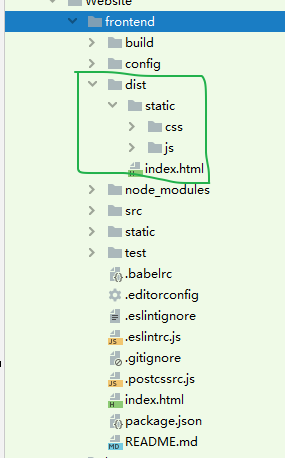
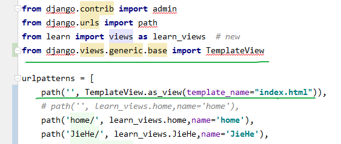
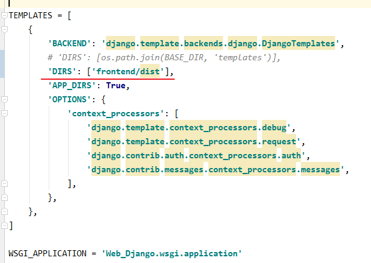
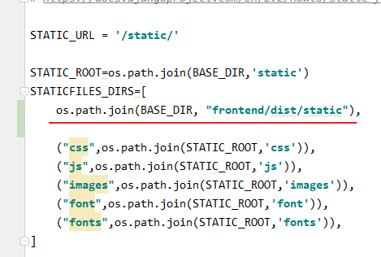
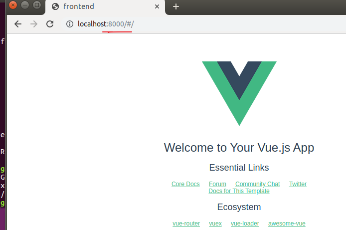

我原本就用Django框架搭建了一个简易的网站，前端是非常简陋的`html+css`写的，确实是丑的人神共愤，于是现在打算前端换用Vue框架来写，将两者结合起来。

## 一、安装Vue

这一步比想象中的要麻烦、坑也很多。首先切换到root账户

> 参考https://blog.csdn.net/Douz_lungfish/article/details/82991738

### 安装nodejs

```
apt update
apt install nodejs
```

验证安装是否成功

```
nodejs -v
```

### 安装npm

```
apt install npm
```

验证安装是否成功

```
npm -v
```

上面这两个安装都很简单，但是按网上博客的步骤来，下一步就要安装cnpm，这一步就非常的坑，总是出问题。cnpm是淘宝团队做的国内镜像，安装完之后就可以只用cnpm而不用npm，但是cnpm的下载总是会出问题，所以这里就不安装cnpm，而是通过改变地址的方法来使用淘宝镜像：

```bash
npm config set registry https://registry.npm.taobao.org
```

验证是否成功改变了下载地址：

```bash
npm config get registry
```

> 参考[npm 和 cnpm](https://www.jianshu.com/p/115594f64b41)

### 安装Vue

```bash
 cnmp install -g @cue/cli
```

验证Vue安装是否成功

```
Vue -v
```


## 二、在Django项目下创建Vue前端项目

在此之前，Django项目的目录结构如下：

```text
.
├── backend
│   ├── __init__.py
│   ├── admin.py
│   ├── migrations
│   │   └── __init__.py
│   ├── models.py
│   ├── tests.py
│   └── views.py
├── manage.py
└── WebDjango
    ├── __init__.py
    ├── settings.py
    ├── urls.py
    └── wsgi.py
```

其中WebDjango为项目名，backend为项目内创建的app，manage.py用来启动Django项目。

我们来到项目目录下，创建Vue前端项目：

```bash
vue init webpack frontend
```

注意的是，这一步，我看网上博客和视频里都是几秒就创建完毕的。但是我实际操作的话，它创建项目后会马上安装相关的依赖，会花费几分钟的时间，在最后他会提示：


因此进入前端项目目录，启动Vue服务：

```bash
cd firstend
#如果上面的提示里有npm install，就应该加上这个命令，用来安装需要的依赖模块
npm run dev 
```

此时项目目录结构为：

```text
.
├── backend
│   ├── __init__.py
│   ├── admin.py
│   ├── migrations
│   │   └── __init__.py
│   ├── models.py
│   ├── tests.py
│   └── views.py
├── frontend
│   ├── README.md
│   ├── build
│   │   └── ....
│   ├── config
│   │   ├── dev.env.js
│   │   ├── index.js
│   │   ├── prod.env.js
│   │   └── test.env.js
│   ├── index.html
│   ├── package.json
│   ├── src
│   │   ├── App.vue
│   │   ├── assets
│   │   │   └── logo.png
│   │   ├── components
│   │   │   └── Hello.vue
│   │   └── main.js
│   ├── static
│   └── test
│       └── ...
├── manage.py
└── WebDjango
    ├── __init__.py
    ├── settings.py
    ├── urls.py
    └── wsgi.py
```

这时打开浏览器，访问`localhost:8080 `就可以看到Vue服务正在运行：



但是这样的话，Django部分项目是用语句`python3 manage.py runserver 0.0.0.0:8000`运行在8000端口，而Vue部分是用语句`npm run dev `运行在8080端口，两者仍然是独立运行的。


## 三、将vue集成到django中

> 参考[django 与 vue 的完美结合](https://my.oschina.net/u/3861934/blog/3006871)   [整合 Django + Vue.js 框架快速搭建web项目](https://cloud.tencent.com/developer/article/1005607)

假设此时Vue前端部分已经写完了（其实根本没有写，不过这里只是测试而已），打包Vue项目：

```bash
npm run build
```

这条命令会将Vue前端部分的所有东西打包成一个dist文件夹（仍然放在frontend目录下）：



先修改Django的`urls.py`文件，添加语句



```python
from django.views.generic.base import TemplateView
```

```python
path('', TemplateView.as_view(template_name="index.html")),
```

这样就可以在访问`localhost:8000`时路由至Vue前端的`dist`目录的index.html页面去，但是前提是Django能读取到Vue部分的路径，因此需要在`settings.py`文件中增加一条语句：

```python
'DIRS': ['frontend/dist'],
```



此外还有一条语句：

```python
os.path.join(BASE_DIR, "frontend/dist/static"),
```



这样就设置完毕了。把Django和Vue的服务都停掉，用命令`python3 manage.py runserver 0.0.0.0:8000`重新打开Django服务，访问8000端口，可见访问到了Vue前端页面：



但是现在问题又来了，依照上面的设置的话，一访问Web网站，就马上路由到Vue前端页面去，那这样的话Django就完全没有用了，因为根本没有机会调用到view.py里的函数。

这里我发现这个博客确实是十分详尽[整合 Django + Vue.js 框架快速搭建web项目](https://cloud.tencent.com/developer/article/1005607)，所以剩下的按它所写的来完成Django与Vue的交互即可，值得注意的是，虽然他写的很详尽，但是其中跨域问题的解决这一步写的不好，可以参考[Django与Vue前后端交互的跨域问题](https://blog.csdn.net/weixin_41519463/article/details/103842779)。