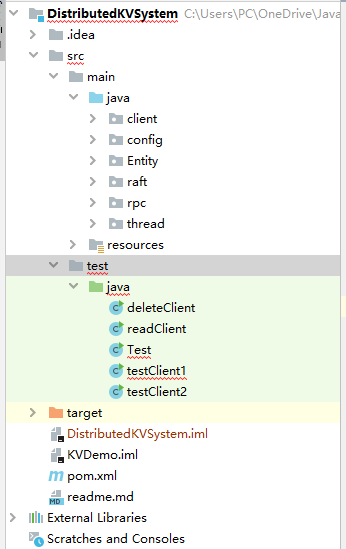
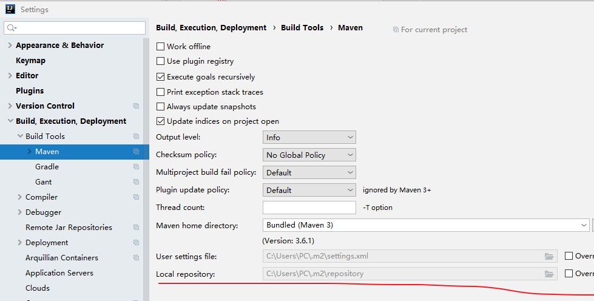
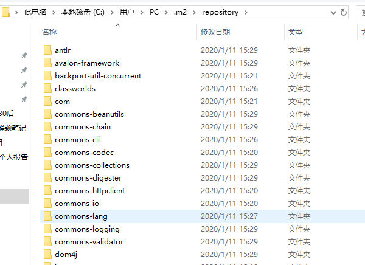
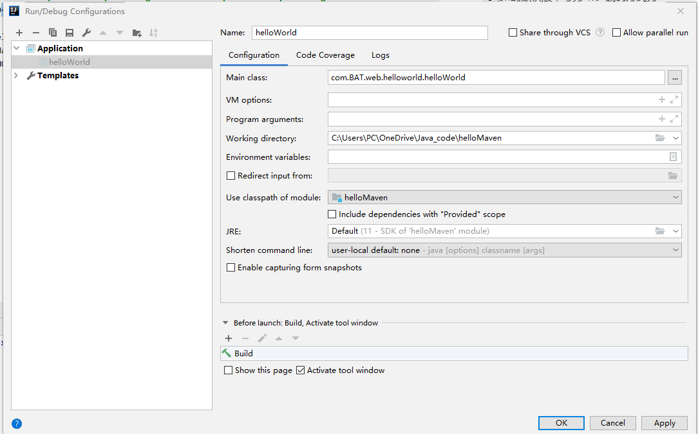

因为要用到一个github开源项目https://github.com/stateIs0/lu-raft-kv，他是基于Maven写的一个Java项目，clone到本地后用IntelliJ IDEA打开，就自动根据pom.xml文件下载依赖了。趁这段时间我也了解了一下Maven是什么东西。

## 一、Maven是什么

> 参考[Maven是什么？](https://blog.csdn.net/tristanly/article/details/89953997)

  在Java开发中，引入jar包的方式从种类上划分，可分为自动导入和手动导入，然而，手动导入繁琐，不是很适合当前开发模式，手动导入也被自动导入所取代。Maven是一个自动导入工具。

Maven 专门用于构建和管理Java项目。使用Maven管理项目的好处主要有两点：

1. **使用Maven管理的Java 项目都有着相同的项目结构**：

   - 有一个pom.xml 用于维护当前项目都用了哪些jar包；
   - 所有的java代码都放在 src/main/java 下面； 
   - 所有的测试代码都放在src/test/java 下面。

   项目目录架构如下图：

    

2. **便于统一维护jar包**
   maven风格的项目，把所有的jar包都放在了本地"仓库“ 里，然后哪个项目需要用到这个jar包，只需要给出jar包的名称和版本号就行了，这样就实现了jar包共享，避免每一个项目都有自己的jar包带来的麻烦。
   如下图所示pom.xml文件声明项目所需要的jar包版本：
   


**仓库**：存放项目所需要的jar包的目录。

IDEA的默认仓库地址：



也就是说，我用IDEA打开Maven项目时，它自动下载的依赖包都下载到这个目录下了：




## 二、创建Maven项目

使用IDEA创建一个Maven demo项目来练手，目的只是弄清楚创建流程而已。

IDEA已经继承了maven，所以不需要自己去下载安装。


### 创建方法

看到一个博客，写的十分详尽[（一）使用IDEA创建Maven项目和Maven使用入门（配图详解）](https://blog.csdn.net/wfy2695766757/article/details/81189291)。

直接参照着来做就完全ok了，是能够成功创建Maven项目的，过程中可能会遇到这个问题[idea报错：Error：java不支持发行版本5的解决方法](https://www.cnblogs.com/wqy0314/p/11726107.html)，参考这个博客配置idea的Java编译器就可以解决了。


### pom.xml 详细介绍

POM( Project Object Model，项目对象模型 ) 是 Maven 工程的基本工作单元，是一个XML文件，包含了项目的基本信息，用于描述项目如何构建，声明项目依赖，等等。上面文章中还包含了pox.xml文件的详细介绍，特地摘抄出来：

```java
<?xml version="1.0" encoding="UTF-8"?>
<project xmlns="http://maven.apache.org/POM/4.0.0"
         xmlns:xsi="http://www.w3.org/2001/XMLSchema-instance"
         xsi:schemaLocation="http://maven.apache.org/POM/4.0.0 http://maven.apache.org/xsd/maven-4.0.0.xsd">
    <modelVersion>4.0.0</modelVersion>

    <groupId>com.BAT.helloMaven</groupId>
    <artifactId>hello-Maven</artifactId>
    <version>1.0-SNAPSHOT</version>


</project>
```

（一）第一行是xml头，指定了xml文档的版本信息和编码方式，目前version的默认版本号为 1.0  编码方式为 UTF-8。

（二）<project>为所有pom.xml的根元素，声明了一些POM相关的命名空间及xsd元素，这些元素不是pom.xml中必须添加的，但是使用这些属性可以使第三方工具，如IDE中的xml编辑器帮助开发者快速编辑POM。

（三）根元素下第一个子元素 <modeVersion> 指定了当前POM模板的版本，对于现在大多数开发者而言，Maven 2  Maven 3 这个版本号只能为4.0.0。

（四）<groupId> 定义了该项目属于哪个项目组，在企业级开发中，通常和该项目所属的组织和公司有关。比如：BATcode上有一个名为ourApp的项目，这样一来groupId的名字就应该是com.BATcode.ourApp。本文中的代码都为com.BAT.helloMaven。

（五）<artifactId>定义了当前Maven项目在项目组的唯一一个ID，本文中 Hello Maven artifactId为hello-Maven，在实际开发中会分配其他的 artifactId ，而之前的 groupId ，可能会为不同的子项目（模块）分配artifactId。

（六）<version>定义了Hello Maven项目当前的版本号 1.0-SNAPSHOT 为IDEA默认的初始版本号，随着项目的开发进度，版本号升级为1.1 、2.0 等。

（七）在没有实际的java代码时，我们就可以完整的创建一个Maven项目的pom.xml，这说明了Maven可以使项目对象模型最大程度的与代码相独立，这充分体现了解耦的原则和理念！为开发者节省了时间，大大缩短了项目开发周期。在项目开发到稳定期时，升级版本时，开发者可以不需要修改实际的 java 代码，而是只修改pom.xml，这一特点使Maven被广泛的使用。


## 三、运行Maven项目

如果Maven项目是一个Web项目，需要IDEA配置Tomcat来部署，可参考[浅谈基于Intellij IDEA Maven的配置与使用](https://www.linuxidc.com/Linux/2019-08/159791.htm)，然而这里要做的是一个本地运行的分布式项目，不需要部署到Tomcat上，只需要配置application，选择main class就可以了



然后点击运行

 