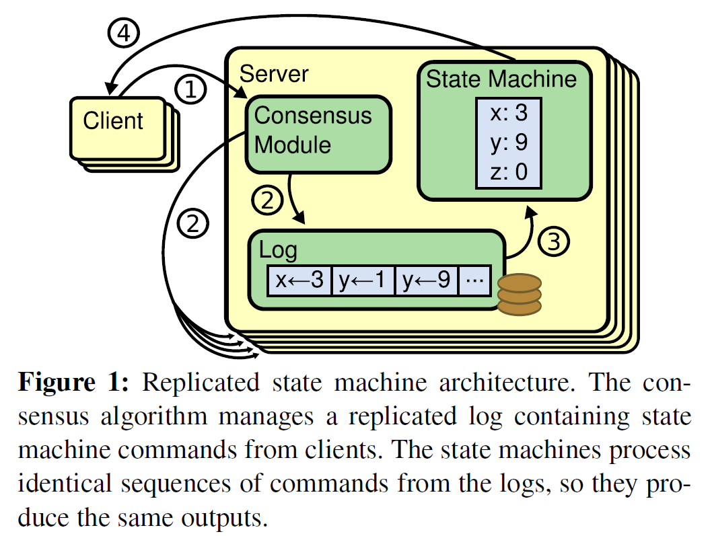
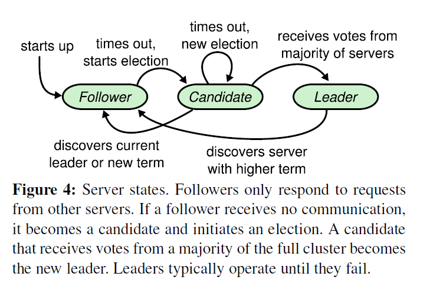
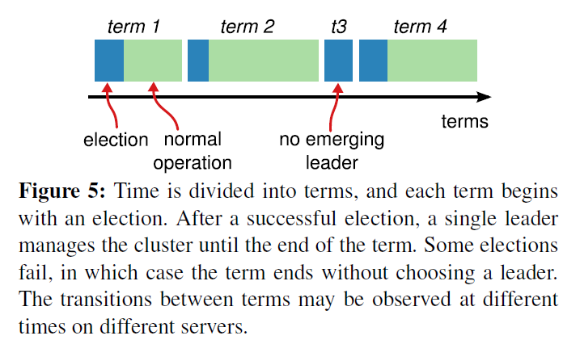
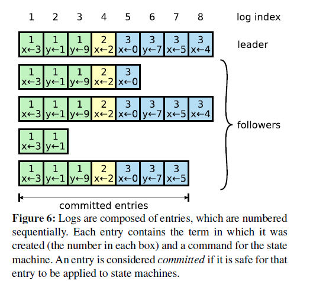
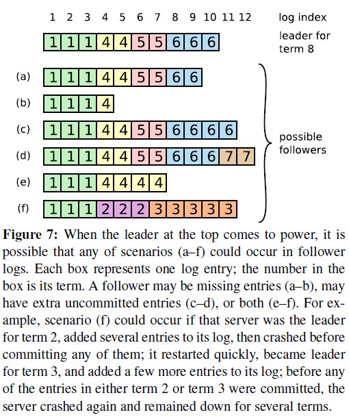

在以及遍览网上Raft的相关博客之后，大致了解了Raft的性质和算法过程，但许多细节还是没有掌握，而且各个博客各执一词，不知谁对谁错，因此看一遍原论文：[Raft论文](https://www.usenix.org/system/files/conference/atc14/atc14-paper-ongaro.pdf)，只看关键算法部分，略过其他部分。

跳过以下这些章节：

- Abstract
- 1 Introduction
- 3 What’s wrong with Paxos?
- 4 Designing for understandability
- 5.4.2 ~ 5.6
- 6 Cluster membership changes
- 7 Clients and log compaction
- 8 Implementation and evaluation
- 9 Related work
- 10 Conclusion

建议先看我总结的Raft简介[分布式理论Paxos, Raft](https://blog.csdn.net/weixin_41519463/article/details/103936685)的Raft部分，大致了解Raft的原理和过程，然后再看下面的细节。

## 2 Replicated state machines

复制状态机被应用在分布式系统中，即使某些节点宕机，也可以继续正常运转。复制状态机基于复制日志实现，复制状态机的结构如下图所示：

每个server节点存储一个日志（log），其中记录着一系列命令（command），这些命令按顺序执行。理想状态下，每个server节点的日志内容完全一致，因此整个分布式系统各节点状态一致、输出结果一致。事实上，Raft一致性算法的目标就是保持各server节点的日志一致。

每个server中的consensus module接收客户端的命令，然后跟其他server节点的consensus module进行交流，有选择性地将这些命令加入到日志中。一旦这些命令加入到日志中并且提交后，每个server的状态机就按日志里的顺序执行这些命令，并且将结果返回给客户端。从结果上来看，仿佛是从一个单一的状态机运行得到的结果一样。

## 5 The Raft consensus algorithm

Raft首先选举出一个leader，让他全权管理日志复制的问题。leader从客户端接收命令，将他们复制到其他server上，并告诉他们什么时候将命令应用到他们的状态机上。

Raft主要分成三个部分：

- Leader election
- Log replication
- Safety

### 5.1 Raft basics

一个sever的身份可以是这其中之一：leader, follower, or candidate。

client只与leader交互，如果client访问follower，follower会将它重定位到leader处去。

term表示一段时间，包含选举阶段和正常运转阶段。每个server存储一个叫current term的数字，他只会单调递增，不会减小。当server与其他server交互的时候会更新自己的current term：

- 如果一个follower见到更大的term ID，就会更新自己的current term为这个term ID
- 如果一个candidate或leader见到更大的term ID，就会转换成follower，并且更新current term为这个term ID。
- 如果一个server收到一个请求，这个请求携带的term ID比自己的current term更小，那么就会立刻拒绝这个请求。

可见term ID越大，当选leader的可能性就越大。

 

Raft使用remote procedure calls(RPCs)来进行server之间的交流，它的一致性算法只需要两种RPCs：

- RequestVote RPCs：选举阶段，candidate调用来发出选举请求。
- AppendEntries RPCs：正常运转阶段，leader调用来复制日志条目，已经发出心跳。

如果server发出RPCs没有得到响应，会在超时后重发。

注意，Raft算法必然遵循以下的原则（具体会在下面章节阐述）：

 

### 5.2 Leader election

Leader周期性发送心跳（使用不带日志记录的AppendEntries RPCs）给follower来维持权威。如果一个follower一段时间没有收到心跳信号，就会触发超时机制（election timeout），开始重新选举，来选出一个新的leader。这个follower首先使自己的term ID + 1，然后把自己转换成candidate状态并且投票给自己，同时并行发送RequestVote RPCs给其他server请求投票。该candidate维持candidate状态，直至以下事件发生：

1. **该candidate赢得选举成为leader**：candidate获得超过半数的投票就赢得这一个term的选举。规定每个server对一个给定的term最多只能投出一票（先到先得），从而保证每个term只有一个赢家。candidate赢得选举后成为leader，并且发送心跳维持权威，防止新的选举发生。
2. **另一个candidate成为leader**：当一个candidate在等待投票时，有可能收到其他新leader的心跳（AppendEntries RPC），如果这个leader的term ID比自己的term ID要大，则该candidate变成follower，如果leader的term ID比自己的term ID小，则该candidate拒绝该RPC并且继续维持candidate状态。
3. **选举超时，没有人赢得选举**：如果大量follower同时超时、成为candidate，则投票分散（都投给自己），没有人拿到多数票，选举没有结果。则所有candidate超时后（随机算法打乱超时时间），term ID +1 ，然后重新选举。

### 5.3 Log replication

leader被选出后开始响应客户端请求，每个客户端请求包含一条命令，leader将这条命令作为一条记录添加到自己的日志上，然后使用AppendEntries RPCs并行发送这个记录到它的follower去。当这个记录安全地复制完毕后，leader状态机就执行这个命令，将结果返回给客户端。如果某些follower没有响应，leader就会锲而不舍的、无限期地给它们重发AppendEntries RPCs直到它们响应，来保证这些follower最终将这个命令保持在它们的日志中。

日志的结构如下图所示：

 

每个日志记录包含了一条状态机命令和它对应的term ID，每个日志记录都有一个整数索引标明它们在日志中的位置。

leader认为一个日志记录可以安全地应用到状态机上时，就认为这个日志记录被提交上去了（committed）。当一个日志记录被leader复制到大多数server上的时候，leader就会把这个日志记录提交上去了。Raft保证一个committed log entry最终会被所有状态机执行。

leader追踪他提交的最新的日志记录的索引（index），并将这个索引附在他随后发送的所有AppendEntries RPCs（包括心跳）上，当follower看到之后，也会将自己的日志提交到自己的状态机上执行。

Raft使日志满足以下属性：

- 不同节点日志中的两个日志记录的index和term ID相同，则他们存储这相同的命令。
- 不同节点日志中的两个日志记录的index和term ID相同，则他们前面的日志记录都相同。

因为leader所创建的每个日志记录都有唯一对应的term ID和index。leader每次发送AppendEntries RPCs都会附上日志记录的term ID和index，如果follower在自己的日志中找不到这条对应的记录，就会拒绝这个RPC。因此，当leader得到响应时，就可以确定这个follower的日志与自己一致。

在正常运转的情况下，leader和follower的日志都会保持一致，但是leader宕机可能会导致日志的不一致，如下图所示（详情参考它的图解文字）：

 

在Raft中，leader通过强行覆盖follower的日志来解决这个不一致的问题。leader首先找到与follower的日志仍保持一致的那个最新的记录点，然后删掉follower的这后面部分，再发送leader的这部分日志记录（全部使用AppendEntries RPCs完成）。leader为每个follower维持一个nexIndex变量，代表leader即将发给follower的下一个日志记录的index。整个过程是这样的：

1. 新leader当选，开始执政，初始化所有nextIndex为自己日志的最后一个记录的index。
2. leader给所有follower发送AppendEntries consistency check，如果follower中不存在nextIndex指向leader日志记录，则会拒绝此RPC。
3. leader被拒后，对应该follower的nextIndex减一，重发AppendEntries RPC。重复这个过程直至follower找到与之一致的日志记录（即term ID和index都相等）。
4. AppendEntries 成功后，删掉follower中所有不一致的日志记录，然后复制后面的日志记录直至与leader一致。

可见leader是不会删减自己的日志的，他会去删减follower的日志来保持与自己一致（leader真是权势滔天）

### 5.4 Safety

上面的机制还不足以保证每个状态机都按相同的顺序执行相同的命令。比如当一个leader提交了很多条日志记录并执行（只要使大多数follower日志一致即可提交）之后，一个follower因为宕机或者网络问题而没有复制和执行到这些日志记录，然后leader宕机，该follower当选，就会导致新的leader强制使其他follower日志与它一致，导致不同状态机可能执行了不同命令。因此这个部分通过限制哪些server可以当选leader，来完善Raft算法。这个限制，确保了新的leader的日志中，必须包含之前leader所提交和执行过的日志记录。也就是说，一旦某个日志记录被提交过，那么后面的leader都必须承认它。

#### 5.4.1 Election restriction

leader必须存有所有已提交的日志记录，因此raft只允许那些日志里包含所有已提交记录的candidate赢得选举。那么重新选举的时候，怎么判定candidate的日志里是否包含了所有已提交记录呢？答案就是：如果candidate的日志与大多数的server的日志一致或更新（日志最后一条记录的index或term更大），则认为candidate日志包含了所有已提交记录。

RequestVote RPC实现了这个限制，即RequestVote RPC包含candidate的日志信息，如果接受到选举请求的server发现自己的日志里有更新的已提交记录，则拒绝他的选举请求。

