docker底层实验LXC（Linux Container）实现，docker是一个开源的应用容器引擎，基于go语言开发并遵循了apache2.0协议开源。docker可以让开发者打包他们的应用以及依赖包到一个轻量级、可移植的容器中，然后发布到任何流行的linux服务器，也可以实现虚拟化。开发人员利用 Docker 消除了协作编码时“只在我的机器上可正常工作”的问题。

Docker 属于 Linux 容器的一种封装，成套地提供了简单易用的容器使用接口。它是事实上目前最流行的 Linux 容器方案。Docker 将应用程序以及该程序运行的依赖计算环境，打包在了一个镜像文件之中。只要运行这个镜像文件，就会生成一个虚拟容器。程序在这个虚拟容器里运行，就如同在真实的物理机上运行一样。

Docker 是一个开源的应用容器引擎，让开发者可以打包他们的应用以及依赖包到一个可移植的容器中，然后发布到任何流行的 Linux 机器上。Docker是一个重新定义了程序开发测试、交付和部署过程的开放平台，Docker则可以称为构建一次，到处运行，这就是Docker提出的"Build once，Run anywhere"。Docker仓库用来保存我们的images，当我们创建了自己的image之后我们就可以使用push命令将它上传到公有或者私有仓库，这样下次要在另外一台机器上使用这个image时候，只需要从仓库上pull下来就可以了。注意：Docker不是容器，而是管理容器的引擎！

> 参考https://blog.csdn.net/qq_35568099/article/details/80359824

## 1、镜像、仓库、容器、虚拟机

### 镜像**（image）**

所谓镜像文件其实和ZIP压缩包类似，它将特定的一系列文件按照一定的格式制作成单一的文件，以方便用户下载和使用，例如一个测试版的操作系统、游戏等。

镜像就是像照镜子一样。我们一般说的镜像是指给系统作个ghost镜像。这样可以在很短时间，很方便的还原出一个完整的系统来。镜像可以说是一种文件,比如iso,gho都属于镜像文件,镜像文件可以直接刻录到光盘中,也可以用虚拟光驱打开。

### **仓库（repository）**

仓库是集中存放镜像文件的场所，仓库注册服务器（Registry）上往往存放着多个仓库，每个仓库中又包含了多个镜像，每个镜像有不同的标签（tag）。目前，最大的公开仓库是 Docker Hub，存放了数量庞大的镜像供用户下载。

### **容器（ Container）**

容器是从镜像创建的运行实例。它可以被启动、开始、停止、删除。每个容器都是相互隔离的、保证安全的平台。可以把容器看做是一个简易版的 Linux 环境，Docker 利用容器来运行应用。

通过镜像启动一个容器，一个镜像是一个可执行的包，其中包括运行应用程序所需要的所有内容包含代码，运行时间，库、环境变量、和配置文件。容器是镜像的运行实例，当被运行时有镜像状态和用户进程，可以使用docker ps 查看。

### 虚拟机（Virtual Machine）

容器在linux上本机运行，并与其他容器共享主机的内核，它运行的一个独立的进程，不占用其他任何可执行文件的内存，非常轻量。

虚拟机运行的是一个完成的操作系统，通过虚拟机管理程序对主机资源进行虚拟访问，相比之下需要的资源更多。

虚拟机和容器的架构图：


左图虚拟机的架构中有4个操作系统(Operating System) ，分别是一个 Host Operating System 和 3个 Guest Operating System，每个虚拟机中都有一个独立的**Kernel**


右图容器的架构中只有一个操作系统，即只有一个独立的**Kernel**

容器可以理解为进程沙盒(sandbox)，沙盒将软件运行于一个受限的系统环境中，控制程序可使用的资源（如文件描述符、内存、磁盘空间等）。

三个虚拟机需要模拟(emulate) 三个操作系统，而三个容器都在一个操作系统上运行，并不需要模拟任何操作系统。所以容器会消耗更少的资源，并达到跟虚拟机架构中等同的效果。

> 参考[虚拟机(Virtual Machine)和容器(Container)的区别](https://www.jianshu.com/p/d132333dbf40)


## 2、大致流程

从仓库（一般为DockerHub）下载（pull）一个镜像，Docker执行run方法得到一个容器，用户在容器里执行各种操作。Docker执行commit方法将一个容器转化为镜像。Docker利用login、push等命令将本地镜像推送（push）到仓库。其他机器或服务器上就可以使用该镜像去生成容器，进而运行相应的应用程序了。


## 3、Ubuntu安装Docker

ubuntu虚拟机装好并安装增强功能后，开始进行Linux上的Docker安装。不得不说Linux上安装Docker真是非常简单，打开命令行，输入以下命令，使用便捷脚本安装docker：

```bash
curl -fsSL https://get.docker.com -o get-docker.sh
sudo sh get-docker.sh
```

然后验证docker：

```bash
#查看docker服务是否启动：
systemctl status docker

#若未启动，则启动docker服务：
sudo systemctl start docker

#测试经典的hello world：
sudo docker run hello-world

```

下面是运行结果，可以看到docker从库里把hello-world的镜像pull到本地然后运行。

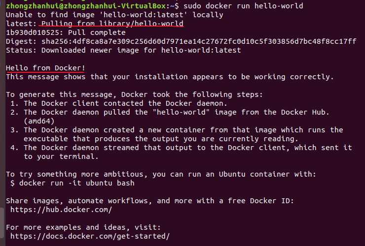

> 参考 [ubuntu18.04安装docker](


### 4、入门Docker基本操作

参考 https://zhuanlan.zhihu.com/p/23599229

### 1、下载镜像

```text
docker pull centos    # 利用pull命令获取镜像
```

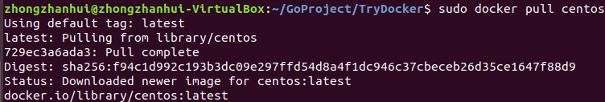

镜像并不是下载到当前文件夹中，想看当前系统中已有的镜像，用下面的命令

```text
docker images    # 查看当前系统中的images信息
```

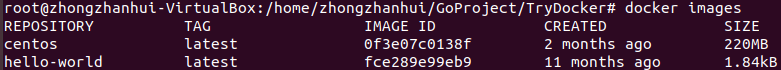


### 2、用镜像启动一个容器

```bash
docker run -it centos:latest /bin/bash    # 启动一个容器
git --version    # 可以看到此时的容器中没有git

yum install git    # centos利用yum安装git
git --version   # 此时的容器中已经装有git了
```

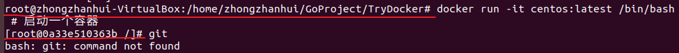

可见启动容器后命令行形式变了，表示已经进入了容器。

```bash
exit    		#退出容器
docker ps -a    #查看docker中所有容器
docker ps		#查看docker中正在运行的容器
```

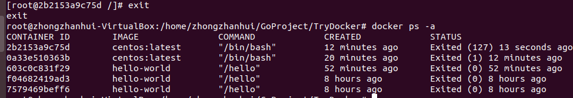

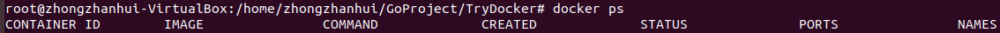

可以看到当前docker中没有正在运行的容器。

此时如果使用exit退出，则容器的状态处于Exit，而不是后台运行。如果想让容器一直运行，而不是停止，可以使用快捷键 ctrl+p ctrl+q 退出，此时容器的状态为Up。

### 3、创建镜像

#### 3.1 修改已有容器作为新的镜像

```bash
docker commit -m "centos with git" -a "zzh" 2b2153a9c75d  zhongzhanhui/centos:git
#-m指定说明信息；-a指定用户信息；2b2153a9c75d代表容器的id；zhongzhanhui/centos:git指定目标镜像的用户名、仓库名和 tag 信息。
```

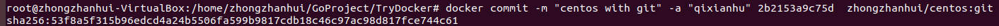

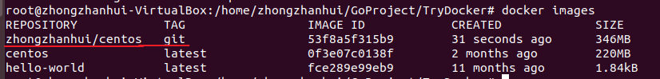

可见此时Docker引擎中就有了我们新建的镜像zhongzhanhui/centos:git

用这个新镜像启动一个容器，可以看到里面已经带有git了

```bash
docker run -it zhongzhanhui/centos:git /bin/bash
git version
```

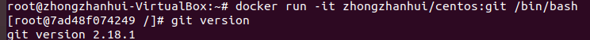

#### 3.2 用Dockerfile创建镜像

Dockerfile是一种配置文件，用来告诉docker build命令应该执行哪些操作。一个简易的Dockerfile文件如下所示

```bash
# 说明该镜像以哪个镜像为基础
FROM centos:latest

# 构建者的基本信息
MAINTAINER zhongzhanhui

# 在build这个镜像时执行的操作
RUN yum update
RUN yum install -y git

# 拷贝文件到镜像中
COPY ./Dockerfile /usr/share/gitdir/
```

有了Dockerfile之后，就可以利用build命令构建镜像了：

```text
docker build -t="zhongzhanhui/centos:gitdir" .
```

其中-t用来指定新镜像的用户信息、tag等。最后的点表示在当前目录寻找Dockerfile。

> 还有一个问题是，build的时候会把当前目录下的文件都发送到Dockerdaemon中，所以最后打开新的文件夹或者在项目文件夹下build。
>
> 此外RUN命令有多条时最好用 && 连起来，否则镜像会一层套一层，比如应该写成
>
> ```bash
> RUN yum update && yum install -y git
> ```

然而镜像一直构建不成功，安装git总是报错，估计是网络问题。

姑且换成下面的操作，只复制文件进入镜像，不执行安装git或vim的操作，Dockerfile如下

```bash
# 说明该镜像以哪个镜像为基础
FROM centos:latest

# 构建者的基本信息
MAINTAINER zhongzhanhui

# 在build这个镜像时执行的操作，不run，因为总是网络不行

# 拷贝文件到镜像中
COPY ./only_a_file /usr/share
```

构建镜像

```bash
docker build -t="zhongzhanhui/centos:try_dockerfile" .
```

运行结果如下

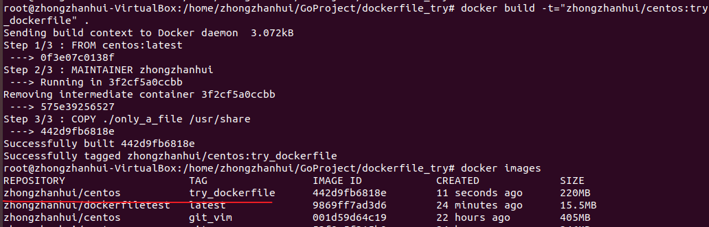

可见镜像创建成功，启动容器检查是否进行了文件复制操作：

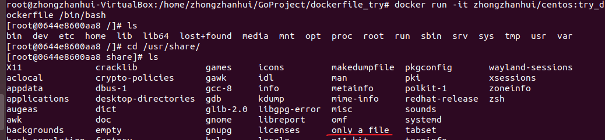

可见确实复制了文件进入镜像中

### 4、删除/保存镜像

删除镜像

```bash
docker rm container_name/container_id   #先删除对应容器
docker rmi image_name/image_id   #再删除镜像
docker rmi imageid     #或者可以根据id删除镜像
```

删除所有容器和镜像

```bash
docker  rm $(docker ps -a -q)
docker rmi $(docker images -q)
```

保存加载镜像

```bash
docker save -o centos.tar xianhu/centos:git    # 保存镜像
docker load -i centos.tar    # 加载镜像
```


### 5、更多容器操作

已经用docker run命令从镜像启动生成容器后，对容器还有这些操作：

```bash
#启动、停止、重启、删除容器命令：
docker start container_name/container_id
docker stop container_name/container_id
docker restart container_name/container_id
docker rm container_name/container_id
docker rm `docker ps -a -q` #删除所有容器
#后台启动一个容器后，如果想进入到这个容器，可以使用attach命令：
docker attach container_name/container_id
```


### 6、Docker仓库

Docker官方维护了一个DockerHub的公共仓库，里边包含有很多平时用的较多的镜像。除了从上边下载（pull）镜像之外，我们也可以将自己自定义的镜像发布（push）到DockerHub上。

在镜像操作章节中，我们新建了一个zhongzhanhui/centos:git镜像。

（1）访问[https://hub.docker.com/](https://link.zhihu.com/?target=https%3A//hub.docker.com/)，如果没有账号，需要先注册一个。

（2）利用命令docker login登录DockerHub，输入用户名、密码即可登录成功：

```bash
docker login
```

（3）将本地的镜像推送到DockerHub上，这里的镜像名zhongzhanhui要和登录时的username一致：

```bash
docker push zhongzhanhui/centos:git    # 成功推送
docker push zzh/centos:git    # 用户名不对应，会导致推送失败
```

（4）以后别人就可以从你的仓库中下载合适的镜像了。

```text
docker pull zhongzhanhui/centos:git
```

对应于镜像的两种创建方法，镜像的更新也有两种：

- 创建容器之后做更改，之后commit生成镜像，然后push到仓库中。
- 更新Dockerfile。在工作时一般建议这种方式，更简洁明了。

