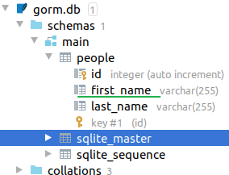
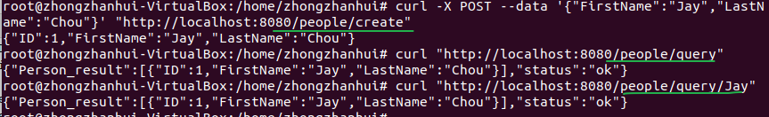
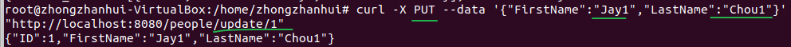
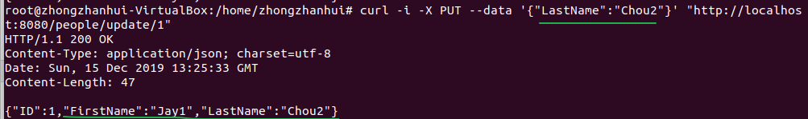
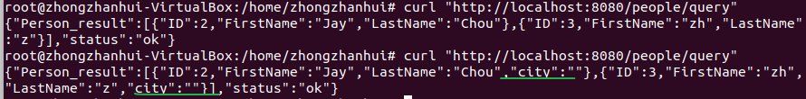
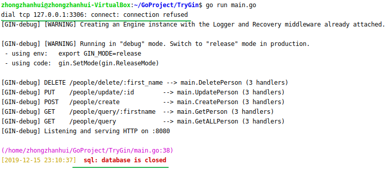

参考[如何使用 Gin 和 Gorm 搭建一个简单的 API 服务](https://www.jianshu.com/p/35665b584347)，但这篇博客只是讲了大概的流程，具体的内容还是要参考[Gorm中文文档](https://jasperxu.github.io/gorm-zh/database.html#dbc)

在这篇文章中，我想用最少的代码写出一个可用的 API 服务。这个 API 可以提供增删改查（CRUD）这些基本功能，对象关系映射 (ORM) 让数据库操作变得非常简单。

代码库：https://github.com/cgrant/gin-gorm-api-example

假设已经了解过了GO语言和Gin框架，参考

[ubuntu16安装golang和goland](https://blog.csdn.net/weixin_41519463/article/details/103463808) ，[Go语言入门教程](https://blog.csdn.net/weixin_41519463/article/details/103498570)， [Gin框架快速入门](https://blog.csdn.net/weixin_41519463/article/details/103544411)

# Gin框架

既然是搭建 API 服务，就需要一个 Web 框架来处理路由并响应 HTTP 请求。Gin的入门参考[Gin框架快速入门](https://blog.csdn.net/weixin_41519463/article/details/103544411)。

写API一般不会反悔字符串这么low，所以这里返回的是JSON格式数据，`main.go`代码如下：

```go
package main

import "github.com/gin-gonic/gin"

func main() {
        r := gin.Default()
        r.GET("/", func(c *gin.Context) {
                c.String(200, "Hello World")
                c.JSON(200, gin.H{
                        "message": "Hello World",
                })
        })
        r.Run()
}
```


# 用 GORM 把数据持久化

## 创建数据库文件

现在让我们考虑一下服务的持久化层，在这部分中，我们将把数据保存在一个本地 SQLite 文件中，在稍后的章节中，我们将改为 MySQL。[Gorm](https://jasperxu.github.io/gorm-zh/)是一个 Go 语言实现的对象关系映射 (ORM) 框架。它简化了程序对数据库的操作。创建sqlite3数据库参考 https://jasperxu.github.io/gorm-zh/database.html#dbc

一个gorm的简例：

```go
package main

import (
        "github.com/jinzhu/gorm"
        _ "github.com/jinzhu/gorm/dialects/sqlite"
)

type Person struct {
        ID        uint   `json:"id"`
        FirstName string `json:"firstname"`
        LastName  string `json:"lastname"`
}

func main() {
        db, _ := gorm.Open("sqlite3", "./gorm.db")
        defer db.Close()

        p1 := Person{FirstName: "John", LastName: "Doe"}
        p2 := Person{FirstName: "Jane", LastName: "Smith"}

        fmt.Println(p1.FirstName)
        fmt.Println(p2.LastName)
}
```

> 当导入一个包时，该包下的文件里所有init()函数都会被执行，然而，有些时候我们并不需要把整个包都导入进来，仅仅是是希望它执行init()函数而已。这个时候就可以使用 import _ 引用该包。即使用【import _ 包路径】只是引用该包，仅仅是为了调用init()函数，所以无法通过包名来调用包中的其他函数。

执行程序后，在项目目录下可以看到一个新文件 `gorm.db`，生成数据库文件大概需要10几秒。这就是 API 的数据库文件了。此外还有两个Person的实例，但没有存入数据库文件中。请注意结构体 Person 里的每个域的名字必须是大写字母开头的，这样 Go 语言才认为这是一个共有域。

## 迁移

参考 https://jasperxu.github.io/gorm-zh/database.html#m

###  自动迁移

自动迁移模式将保持更新到最新。自动迁移**仅仅**会创建表，缺少列和索引

```go
db.AutoMigrate(&User{})  //创建一个表
db.AutoMigrate(&User{}, &Product{}, &Order{}) //创建多个表
db.Set("gorm:table_options", "ENGINE=InnoDB").AutoMigrate(&User{}) // 创建表时添加表后缀
```

### 检查表是否存在

```go
db.HasTable(&User{})  // 检查模型`User`表是否存在
db.HasTable("users") // 检查表`users`是否存在
```

### 创建表

```go
// 为模型`User`创建表
db.CreateTable(&User{})

// 创建表`users'时将“ENGINE = InnoDB”附加到SQL语句
db.Set("gorm:table_options", "ENGINE=InnoDB").CreateTable(&User{})
```

### 删除表

```go
// 删除模型`User`的表
db.DropTable(&User{})

// 删除表`users`
db.DropTable("users")

// 删除模型`User`的表和表`products`
db.DropTableIfExists(&User{}, "products")
```

### 修改列

修改列的类型为给定值

```go
// 修改模型`User`的description列的数据类型为`text`
db.Model(&User{}).ModifyColumn("description", "text")
```

### 删除列

```go
// 删除模型`User`的description列
db.Model(&User{}).DropColumn("description")
```

### 添加外键

```go
// 添加主键
// 1st param : 外键字段
// 2nd param : 外键表(字段)
// 3rd param : ONDELETE
// 4th param : ONUPDATE
db.Model(&User{}).AddForeignKey("city_id", "cities(id)", "RESTRICT", "RESTRICT")
```

> 定义主键和外键主要是为了维护关系数据库的完整性，总结一下：
> 1.主键是能确定一条记录的唯一标识，比如，一条记录包括身份正号，姓名，年龄。身份证号是唯一能确定你这个人的，其他都可能有重复，所以，身份证号是主键。 
> 2.外键用于与另一张表的关联。是能确定另一张表记录的字段，用于保持数据的一致性。
>
> 比如，A表中的一个字段，是B表的主键，那他就可以是A表的外键。

### 索引

```go
// 为`name`列添加索引`idx_user_name`
db.Model(&User{}).AddIndex("idx_user_name", "name")

// 为`name`, `age`列添加索引`idx_user_name_age`
db.Model(&User{}).AddIndex("idx_user_name_age", "name", "age")

// 添加唯一索引
db.Model(&User{}).AddUniqueIndex("idx_user_name", "name")

// 为多列添加唯一索引
db.Model(&User{}).AddUniqueIndex("idx_user_name_age", "name", "age")

// 删除索引
db.Model(&User{}).RemoveIndex("idx_user_name")
```


## CURD读写操作

参考https://jasperxu.github.io/gorm-zh/crud.html

### 创建记录

- `NewRecord` 检查主键是否存在
- `Create` 即执行 insert 操作

```go
user := User{Name: "Jinzhu", Age: 18, Birthday: time.Now()}

db.NewRecord(user) // => 主键为空返回`true`
db.Create(&user)	// insert操作
db.NewRecord(user) // => 创建`user`后返回`false`
```

### 查询

```go
// 获取第一条记录，按主键排序
db.First(&user)
//// SELECT * FROM users ORDER BY id LIMIT 1;

// 获取最后一条记录，按主键排序
db.Last(&user)
//// SELECT * FROM users ORDER BY id DESC LIMIT 1;

// 获取所有记录
db.Find(&users)
//// SELECT * FROM users;

// 使用主键获取记录
db.First(&user, 10)
//// SELECT * FROM users WHERE id = 10;
```

### Where查询条件 (简单SQL)

```go
// 获取第一个匹配记录
db.Where("name = ?", "jinzhu").First(&user)
//// SELECT * FROM users WHERE name = 'jinzhu' limit 1;

// 获取所有匹配记录
db.Where("name = ?", "jinzhu").Find(&users)
//// SELECT * FROM users WHERE name = 'jinzhu';

db.Where("name <> ?", "jinzhu").Find(&users)

// IN
db.Where("name in (?)", []string{"jinzhu", "jinzhu 2"}).Find(&users)

// LIKE
db.Where("name LIKE ?", "%jin%").Find(&users)

// AND
db.Where("name = ? AND age >= ?", "jinzhu", "22").Find(&users)

// Time
db.Where("updated_at > ?", lastWeek).Find(&users)

db.Where("created_at BETWEEN ? AND ?", lastWeek, today).Find(&users)
```


除此之外还有许多查询操作，具体用到时再查看https://jasperxu.github.io/gorm-zh/crud.html#q


## 继续看gin+gorm

### 简单的gorm例子

```go
package main

import (
        "github.com/jinzhu/gorm"
        _ "github.com/jinzhu/gorm/dialects/sqlite"
)

type Person struct {
        ID        uint   `json:"id"`
        FirstName string `json:"firstname"`
        LastName  string `json:"lastname"`
}

func main() {
        db, _ := gorm.Open("sqlite3", "./gorm.db")
        defer db.Close() //defer 语句块中的代码不会立即被执行，而是会再我们这个函数退出后才会执行

        db.AutoMigrate(&Person{})

        p1 := Person{FirstName: "John", LastName: "Doe"}
        p2 := Person{FirstName: "Jane", LastName: "Smith"}

        db.Create(&p1)
        var p3 Person
        db.First(&p3)

        fmt.Println(p1.FirstName)
        fmt.Println(p2.LastName)
        fmt.Println(p3.LastName)
}
```

以上代码先是用` db.AutoMigrate(&Person{})`创建一个Person表，然后语句`db.Create(&p1)`将p1插入表中，最后用语句` db.First(&p3)`查询得到表中第一个记录，放到p3中，此时p1=p3。注意p1被插入数据库中，程序结束后也会一直存在。

### 查询所有记录（加上gin框架）

```go
package main

import (
	"fmt"
	"github.com/gin-gonic/gin"
	"github.com/jinzhu/gorm"
	_ "github.com/jinzhu/gorm/dialects/sqlite"
)

var db *gorm.DB
var err error

type Person struct {
	ID        uint   `json:"id”`
	FirstName string `json:"firstname”`
	LastName  string `json:"lastname”`
}

func main() {
	// NOTE: See we’re using = to assign the global var
	// instead of := which would assign it only in this function
	db, err = gorm.Open("sqlite3", "./gorm.db")
	if err != nil {
		fmt.Println(err)
	}
	defer db.Close() //defer 语句块中的代码不会立即被执行，而是会再我们这个函数退出后才会执行
	db.AutoMigrate(&Person{})

	r := gin.Default()
	r.GET("/", GetProjects)
	r.Run(":8080")
}

func GetProjects(c *gin.Context) {
	var people []Person
	if err := db.Find(&people).Error; err != nil {
		c.AbortWithStatus(404)
		fmt.Println(err)
	} else {
		c.JSON(200, people)
	}
}
```

运行以上代码 `go run main.go`，命令行输入命令

```bash
curl "http://localhost:8080" 
```

就会从数据库中查询Person表的所有记录作为响应。但是一般实用的API都是查询特定的记录的，因此改为下面的代码。

### 查询特定记录

```go
package main

import (
	"fmt"
	"github.com/gin-gonic/gin"
	"github.com/jinzhu/gorm"
	_ "github.com/jinzhu/gorm/dialects/sqlite"
	"log"
	"net/http"
)

var db *gorm.DB
var err error

type Person struct {
	ID        uint   `json:"id”`
	FirstName string `json:"firstname”`
	LastName  string `json:"lastname”`
}

func main() {
	// NOTE: See we’re using = to assign the global var
	// instead of := which would assign it only in this function
	db, err = gorm.Open("sqlite3", "./gorm.db")
	if err != nil {
		fmt.Println(err)
	}
	defer db.Close() //defer 语句块中的代码不会立即被执行，而是会再我们这个函数退出后才会执行
	db.AutoMigrate(&Person{})

	r := gin.Default()
	r.GET("/people/:firstname", GetPerson)
	r.GET("/people", GetALLPerson)
	r.Run(":8080")
}
func GetPerson(ctx *gin.Context){
	var people []Person
	firstname := ctx.Params.ByName("firstname")
	log.Println("firstname_in_url = ",firstname)
	err := db.Where("firstname = ?",firstname).Find(&people).Error
	if err != nil{//fail
		ctx.JSON(http.StatusNotFound,gin.H{"status":"fail"})
	} else {
		ctx.JSON(http.StatusOK,gin.H{"status":"ok","person_result":people})
	}
}
func GetALLPerson(ctx *gin.Context){
	var people []Person
	err := db.Find(&people).Error
	if err != nil{//fail
		ctx.JSON(http.StatusNotFound,gin.H{"status":"fail"})
	} else {
		ctx.JSON(http.StatusOK,gin.H{"status":"ok","person_result":people})
	}
}
```

```bash
curl "http://localhost:8080/people"  #查询所有记录
curl "http://localhost:8080/people/John" #查询firstname为John的记录
```

但是奇怪的是，提示报错 `no such column : FirstName`，我用GoLand查看数据库文件gorm.db查看（查看方法参考[goland直接查看数据库 sqlite3 文件](https://www.jianshu.com/p/c9e2a56fc969)，最重要是安装sqlite3驱动）。然后发现竟然是`first_name`，暂时没有搞懂为什么会这样命名。




于是我修改查询部分的代码，并且加上插入记录。

### 插入记录

```go
package main

import (
	"fmt"
	"github.com/gin-gonic/gin"
	"github.com/jinzhu/gorm"
	_ "github.com/jinzhu/gorm/dialects/sqlite"
	"log"
	"net/http"
)

var db *gorm.DB
var err error

type Person struct {
	ID        uint   `json:"id”`
	FirstName string `json:"firstname”`
	LastName  string `json:"lastname”`
}

func main() {
	// NOTE: See we’re using = to assign the global var
	// instead of := which would assign it only in this function
	db, err = gorm.Open("sqlite3", "./gorm.db")
	if err != nil {
		fmt.Println(err)
	}
	defer db.Close() //defer 语句块中的代码不会立即被执行，而是会再我们这个函数退出后才会执行
	db.AutoMigrate(&Person{})

	r := gin.Default()
	v1 := r.Group("/people")
	{
		v1.POST("/create",CreatePerson)
		v1.GET("/query/:firstname", GetPerson)
		v1.GET("/query", GetALLPerson)
	}

	r.Run(":8080")
}
func CreatePerson(ctx *gin.Context){
	var Person Person
	ctx.BindJSON(&Person)
	db.Create(&Person)
	ctx.JSON(200,Person)
}
func GetPerson(ctx *gin.Context){
	var people []Person
	firstname := ctx.Params.ByName("firstname")
	log.Println("firstname_in_url = ",firstname)
	err := db.Where("first_name = ?",firstname).Find(&people).Error
	if err != nil{//fail
		ctx.JSON(http.StatusNotFound,gin.H{"status":"fail"})
	} else {
		ctx.JSON(http.StatusOK,gin.H{"status":"ok","Person_result":people})
	}
}
func GetALLPerson(ctx *gin.Context){
	var people []Person
	err := db.Find(&people).Error
	if err != nil{//fail
		ctx.JSON(http.StatusNotFound,gin.H{"status":"fail"})
	} else {
		ctx.JSON(http.StatusOK,gin.H{"status":"ok","Person_result":people})
	}
}
```

其中插入记录的命令为

```bash
curl -X POST --data '{"FirstName":"Jay","LastName":"Chou"}' "http://localhost:8080/people/create"
```




### 更新

```go
//省略
var db *gorm.DB
var err error

type Person struct {
	ID        uint   `json:"id”`
	FirstName string `json:"firstname”`
	LastName  string `json:"lastname”`
}

func main() {
	db, err = gorm.Open("sqlite3", "./gorm.db")
	if err != nil {
		fmt.Println(err)
	}
	defer db.Close() //defer 语句块中的代码不会立即被执行，而是会再我们这个函数退出后才会执行
	db.AutoMigrate(&Person{})

	r := gin.Default()
	v1 := r.Group("/people")
	{
		v1.PUT("/update/:id",UpdatePerson)
		v1.POST("/create",CreatePerson)
		v1.GET("/query/:firstname", GetPerson)
		v1.GET("/query", GetALLPerson)
	}

	r.Run(":8080")
}
func UpdatePerson(ctx *gin.Context){
	var person Person
	id := ctx.Params.ByName("id")
	if err := db.Where("id = ?",id).First(&person).Error; err != nil{
		ctx.JSON(404,gin.H{"status":"fail"})
	} else{
		ctx.BindJSON(&person)
		db.Save(&person)
		ctx.JSON(200,person)
	}

}
//省略其他函数
```

更新命令：

```bash
curl -X PUT --data '{"FirstName":"Jay1","LastName":"Chou1"}' "http://localhost:8080/people/update/1"
```



将`id=1`的记录更新为`firstname=Jay1,lastname=Chou1`

也可以只改`LastName`，这样`FirstName`会保持原来的值。

```bash
curl -i -X PUT --data '{"LastName":"Chou2"}' "http://localhost:8080/people/update/1"
```



> 至于为什么用PUT而不是POST请求方式，我暂时也看不懂，有空谷歌查一下。


### 删除

```go
//以上省略
type Person struct {
	ID        uint   `json:"id”`
	FirstName string `json:"firstname”`
	LastName  string `json:"lastname”`
}

func main() {
	// NOTE: See we’re using = to assign the global var
	// instead of := which would assign it only in this function
	db, err = gorm.Open("sqlite3", "./gorm.db")
	if err != nil {
		fmt.Println(err)
	}
	defer db.Close() //defer 语句块中的代码不会立即被执行，而是会再我们这个函数退出后才会执行
	db.AutoMigrate(&Person{})

	r := gin.Default()
	v1 := r.Group("/people")
	{
		v1.DELETE("/delete/:first_name",DeletePerson)
		v1.PUT("/update/:id",UpdatePerson)
		v1.POST("/create",CreatePerson)
		v1.GET("/query/:firstname", GetPerson)
		v1.GET("/query", GetALLPerson)
	}

	r.Run(":8080")
}
func DeletePerson(ctx *gin.Context){
	var person Person
	first_name := ctx.Params.ByName("first_name")
	err := db.Where("first_name = ?",first_name).Delete(&person).Error
	ctx.JSON(200,gin.H{"status":"delete successfully","err":err})

}
//以下省略
```

删除`first_name`为`Jay1`的记录

```bash
curl -X DELETE "http://localhost:8080/people/delete/Jay1"
```


### 修改数据结构

只要修改 Person 结构体，数据库和 API 都会自动做出相应的修改。

直接在 Person 结构体中添加 city 字段，不需要做其他任何改动，然后重新运行Gin框架，查看所有记录：



可见，新增的字段已经加入表中，且赋予了默认值（字符串类型默认值为空串），这都是因为 main 函数中的`db.AutoMigrate(&Person{})`，自动将旧的数据迁移到新表中。


### 换用MySQL

只需要替换一下 import 声明和数据库连接就行了。

import 声明代码：

```go
import _ “github.com/go-sql-driver/mysql”
```

数据库连接代码：

```bash
db, _ = gorm.Open("mysql", "user:pass@tcp(127.0.0.1:3306)/database?charset=utf8&parseTime=True&loc=Local")
```

然而这里出了大问题，会报错，而且陆陆续续会出现好多坑，把我卡住了很久



1. mysql是需要事先安装好才能用的。

    参考[Ubuntu 安装mysql和简单操作](https://www.cnblogs.com/lfri/p/10437694.html)

    安装
    
```bash
    sudo apt-get install mysql-server          #服务端
sudo apt-get install mysql-client          #客户端
```

    验证安装
    
    ```bash
    apt-get install net-tools
    sudo netstat -tap | grep mysql
    ```
    
    如果看到有mysql 的socket处于 listen 状态则表示安装成功。然后输入下面命令登录：
    
    ```bash
    mysql -u root -p 
    ```
    
    -u 表示选择登录的用户名， -p 表示登录的用户密码，上面命令输入之后会提示输入密码，由于默认是没有密码的，因此直接按Enter就能进入mysql环境。登录mysql后输入以下命令查看数据库信息：
    
    ```bash
    show databases; #查看当前有哪些数据库
    use mysql;  #接下来的命令都是针对mysql这个库
    show tables; #查看有哪些数据表
    ```
    
    但是这种连接入mysql的方式不适用于gorm，因为gorm对应的方式是
    
    ```bash
    #连接数据库
    mysql -h 127.0.0.1 -P 3306 -uroot -p123456
    #-h为远程IP，-P为端口号，-u为用户名，-p为密码
    ```

2. 命令行使用使用上面的明文密码登录命令被拒绝，mysql: [Warning] Using a password on the command line interface can be insec......同样的gorm中连接数据库也被拒绝，ERROR 1698 (28000): Access denied for user 'root'@'localhost'。

   参考解决方法：[mysql出现ERROR1698(28000):Access denied for user root@localhost错误解决方法](https://www.cnblogs.com/cpl9412290130/p/9583868.html)

   - **step1：**在ubuntu的terminal（也即终端）上输入

     ```bash
     sudo vim /etc/mysql/mysql.conf.d/mysqld.cnf
     ```

     进入到这个配置文件，然后在这个配置文件中的**[mysqld]**这一块中加入`skip-grant-tables`这句话，保存。输入命令重新启动mysql:

     ```bash
     service mysql restart
     ```

   - **step2：**在终端上输入mysql -u root -p，遇见输入密码的提示直接回车即可,进入mysql后，分别执行下面命令：

     ```mysql
     use mysql;  
     update user set authentication_string=password("你的密码") where user="root";  
     flush privileges;  
     select user,plugin from user;
     update user set authentication_string=password("123456"),plugin='mysql_native_password' where user='root';
     select user,plugin from user;
     quit;
     ```

   - **step3：**重新进入到mysqld.cnf文件中去把刚开始加的skip-grant-tables这条语句给注释掉。

3. 经过步骤2之后，就能够连上mysql数据库了，但是每当想要对数据库进行创建表或者查询表的操作时就马上报http 500的错误，提示 runtime error: invalid memory address or nil pointer dereference

   网上查询+检查后发现是因为我把db定义为全局变量，但是在main函数里却使用了 `:=`的方式使得他变成了局部变量，导致在main函数外调用db就会出错。

经过以上步骤之后mysql终于能够正常运作。代码如下：

```go
package main

import (
	"fmt"
	"github.com/gin-gonic/gin"
	"github.com/jinzhu/gorm"
	_ "github.com/go-sql-driver/mysql"
	//_ "github.com/jinzhu/gorm/dialects/sqlite"
	"log"
	"net/http"
)

var db *gorm.DB
var err error

type Person struct {
	ID        uint   `json:"id”`
	FirstName string `json:"firstname”`
	LastName  string `json:"lastname”`
	City 	string `json:"city"`
}

func main() {
	// NOTE: See we’re using = to assign the global var
	// instead of := which would assign it only in this function
	
	//db, err = gorm.Open("sqlite3", "./gorm.db")
	//if err != nil {
	//	fmt.Println(err)
	//}
	
	//db,err = gorm.Open("mysql","root:123456@tcp(127.0.0.1:3306)/mysql?charset=utf8&parseTime=True&loc=Local")
	db, _ = gorm.Open("mysql", "user:pass@tcp(127.0.0.1:3306)/mysql?charset=utf8&parseTime=True&loc=Local") //oh shit , dont use :=
	
	if err != nil {
		fmt.Println(err)
	}
	db.SingularTable(true)
	defer db.Close() //defer 语句块中的代码不会立即被执行，而是会再我们这个函数退出后才会执行
	db.AutoMigrate(&Person{})
	fmt.Println("has table person: ",db.HasTable(&Person{}))

	r := gin.Default()
	v1 := r.Group("/people")
	{
		v1.DELETE("/delete/:first_name",DeletePerson)
		v1.PUT("/update/:id",UpdatePerson)
		v1.POST("/create",CreatePerson)
		v1.GET("/query/:firstname", GetPerson)
		v1.GET("/query", GetALLPerson)
	}

	r.Run(":8080")
}
func DeletePerson(ctx *gin.Context){
	var person Person
	first_name := ctx.Params.ByName("first_name")
	err := db.Where("first_name = ?",first_name).Delete(&person).Error
	ctx.JSON(200,gin.H{"status":"delete successfully","err":err})

}
func UpdatePerson(ctx *gin.Context){
	var person Person
	id := ctx.Params.ByName("id")
	if err := db.Where("id = ?",id).First(&person).Error; err != nil{
		ctx.JSON(404,gin.H{"status":"fail"})
	} else{
		ctx.BindJSON(&person)
		db.Save(&person)
		ctx.JSON(200,person)
	}

}
func CreatePerson(ctx *gin.Context){
	var person Person
	ctx.BindJSON(&person)
	db.Create(&person)
	ctx.JSON(200,person)
}
func GetPerson(ctx *gin.Context){
	var people []Person
	firstname := ctx.Params.ByName("firstname")
	log.Println("firstname_in_url = ",firstname)
	err := db.Where("first_name = ?",firstname).Find(&people).Error
	if err != nil{//fail
		ctx.JSON(http.StatusNotFound,gin.H{"status":"fail"})
	} else {
		ctx.JSON(http.StatusOK,gin.H{"status":"ok","Person_result":people})
	}
}
func GetALLPerson(ctx *gin.Context){
	var people []Person
	err := db.Find(&people).Error
	if err != nil{//fail
		ctx.JSON(http.StatusNotFound,gin.H{"status":"fail"})
	} else {
		ctx.JSON(http.StatusOK,gin.H{"status":"ok","Person_result":people})
	}
}
```

重要的是连接mysql数据库的语句

```go
db, _ = gorm.Open("mysql", "user:pass@tcp(127.0.0.1:3306)/mysql?charset=utf8&parseTime=True&loc=Local") 
```

这里面需要提供用户名、密码、地址、端口号、数据库名。然而事实上最重要的是数据库名要正确，用户名和密码可以随便填；地址和端口号可以不写（mysql默认是127.0.0.1:3306），但不能写错；

至此gorm教程看完。