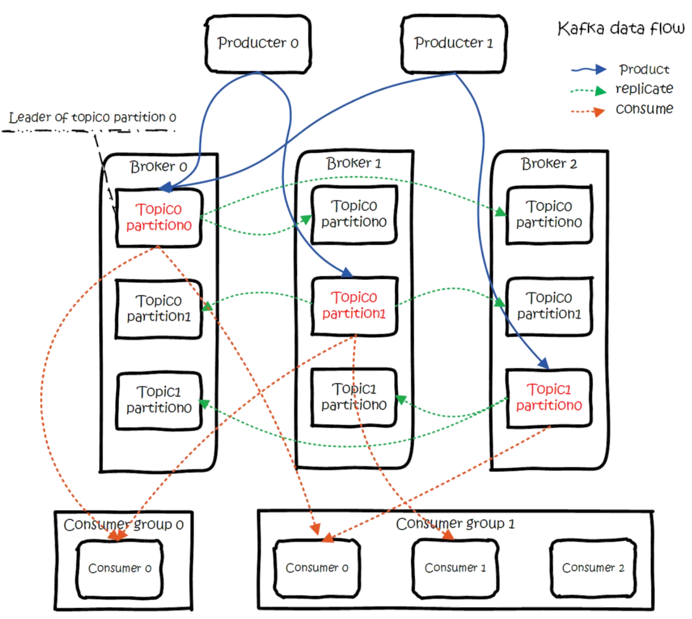
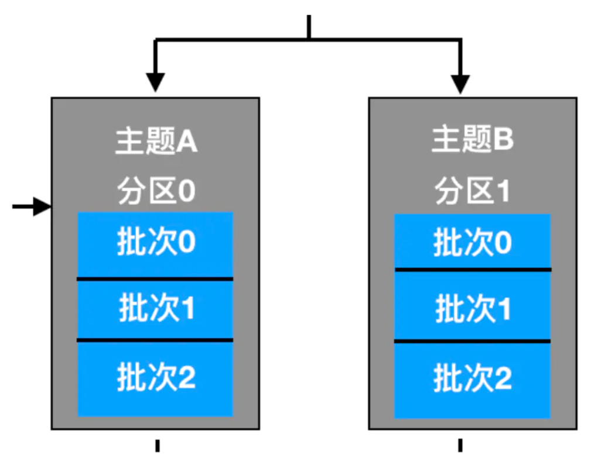
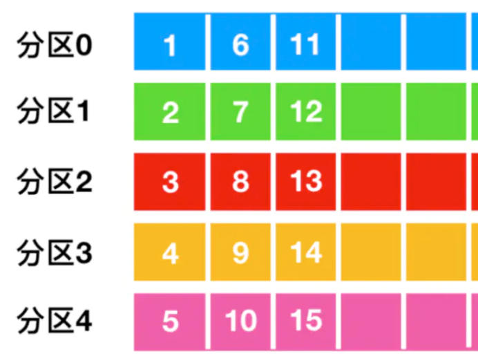
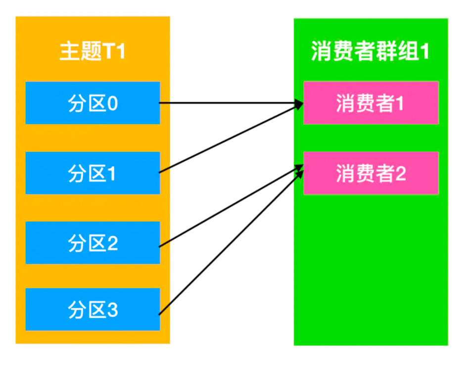
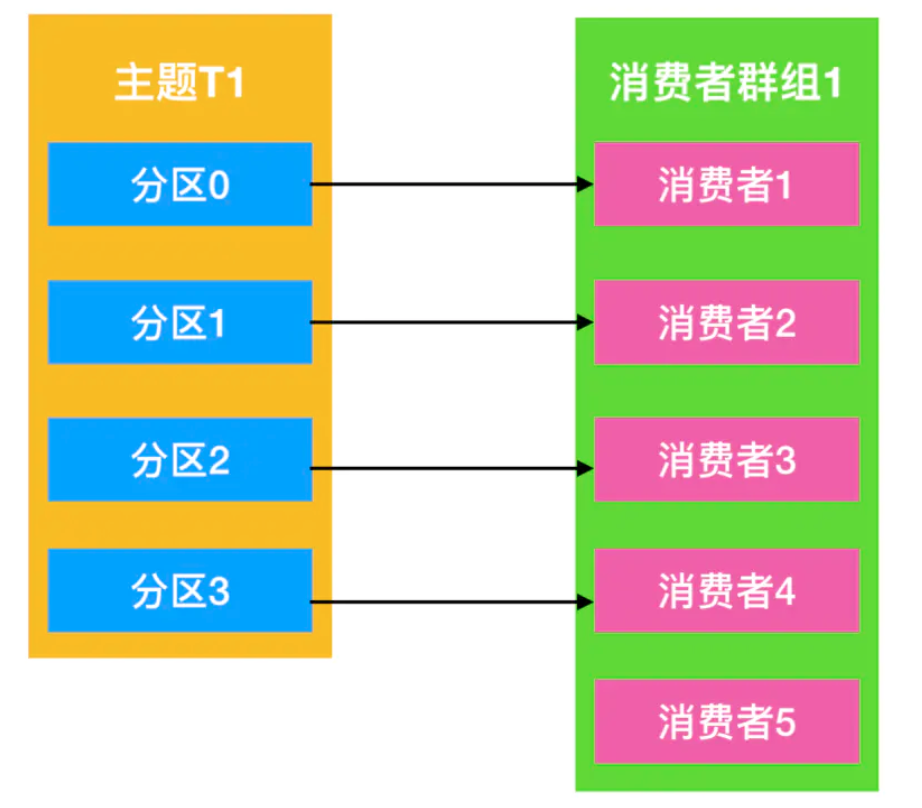

kafka是一个分布式消息队列。拥有高性能、持久化、多副本备份、可伸缩性的功能。基本逻辑是生产者往kafka中生产消息，消费者从kafka中消费消息。使用kafka能够起到解耦、削峰、异步处理的作用。

注意producer 将消息推送到 broker，consumer 从 broker 拉取消息（consumer主动去向pull消息，而不是kafka将消息push给consumer）

> 参考[真的，Kafka 入门一篇文章就够了](https://juejin.im/post/5ddf5659518825782d599641#heading-24)

## 消息

producer生产一条消息有以下参数：

- topic：往哪个topic生产消息。
- partition：往哪个partition生产消息。 
- key：根据该key将消息分区到不同partition。
- message：消息。

## 基本概念 

### broker

一个broker就是一个服务器节点，用于存储topic数据。如果一个topic有多个partition，那么一个broker只能存储该topic的其中一个partition，目的是使topic的partition分布更均衡，即producer或者consumer对一个topic进行操作时，可以将服务器负担均衡地分摊到各个broker上。

### topic

每条消息都有一个主题，即topic。主题用于建立producer和consumer之间的订阅关系，producer向一个topic下生产消息，消费者从这个topic下消费消息。

### partition

一个topic分为多个partition，均匀分布到不同的broker上，每条partition是一个有序队列，其中的每条消息都分配有一个有序的id（offset）。partition机制实现了kafka的可伸缩性，当某个topic需要存取的消息超过负载时，只要增加partition就可以满足需求。

### producer

producer将消息发布到kafka的一个topic中，broker接受到消息后，将其追加到该topic的其中一个partition的队尾。（kafka基于磁盘，使用append方式追加到队尾相当于磁盘顺序读写，开销小速度快）

### consumer

consumer从topic中读取消息。

### consumer group

每个consumer属于一个特定的consumer group（不指定group的consumer属于默认的group），不同的consumer group可以共享一条消息，但是一个consumer group中只能有一个consumer消费这条信息。

## 例子

 

### 生产

producer首先创建一条消息，包含以下内容：

- topic（必填）：往哪个topic生产消息。
- partition：往哪个partition生产消息。 
- key：根据该key将消息分区到不同partition。
- message（必填）：消息。

如果partition已填，就按照topic和partition将该消息放进对应分区的缓冲区中，等到缓冲区的消息数量足够多时，再分批次发送到kafka中存储该topic的该partition的broker中。

  		

如果partition没填，就按照key进行哈希，映射到一个partition中（同一个key对应同一个partition），如果key也没填，就按照轮询调度算法来选partition：

 

### 多副本备份

每个topic在创建时会要求制定它的副本数，kafka备份是以partition为单位的，以上图为例，topic0有两个partition，每个partition都有两个备份，存放在不同的broker上。kafka为该partition选举出一个leader，所有有关该partition的操作都由leader所在的broker处理来处理，然后将消息同步到两个follower上（批量复制）。图中红色的就是leader。

当一个broker宕机时，所有leader在此broker上的partition都要重新选举，让其中一个follower成为新的leader。

### 消费

topic的订阅是以一个consumer group为单位来订阅的。

如果只有一个consumer订阅一个topic，那么这个consumer就需要接受这个topic的所有分区的数据，压力很大。因此后来有了consumer group，其中每个partition只能由一个consumer接收，但是一个consumer可以接受多个partition的数据（左图）。如果consumer数量多于topic的partition数量，那么必然有consumer闲置（右图）。

  			 

一个topic可以由多个consumer group消费
 

随着一个个的consumer加入consumer group，分区的所有权发生转移，这就叫做重平衡（rebalance），重平衡为consumer group带来了高可用性和伸缩性，能够处理consumer宕机或者有新consumer加入群组的问题，缺点是重平衡时所有consumer必须停止消费信息，直到重平衡完成。

创建消费者时可以指定一个群组id。订阅topic时可以订阅多个topic。生产者发送数据给kafka，消费者是如何得知生产者发送的数据呢？KafkaConsumer实际上采用轮询的方式定期到Kafka Broker中查看是否有数据，如果有数据就进行消费。

消费者每次消费数据的时候，消费者都会记录消费的物理偏移量（offset）的位置。等到下次消费时，他会接着上次位置继续消费。（消费者甚至可以调整offset，使其能够读到旧的已读过的消息）

## ZooKeeper的作用

Zookeeper的主要作用是在集群中的不同节点之间建立协调。

zookeeper记录了所有broker的存活状态，broker定时向zookeeper发送心跳请求来维持自己的存货状态。

zookeeper负责从集群的broker中选举出一个作为controller，每当一个partition的leader故障时，由controller选举出新的leader。

zookeeper记录ISR的信息。ISR维护了与leader信息一致的follower的信息，这样当leader挂掉时就可以从ISR中的follower中重新选举，那些信息与leader不一致的follower会被踢出ISR。

曾经offset也是记录在zookeeper中的，后来kafka改成自己记录了。

此外zookeeper还有很多作用，kafka不可能脱离zookeeper。

