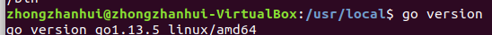
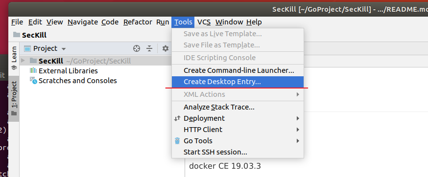
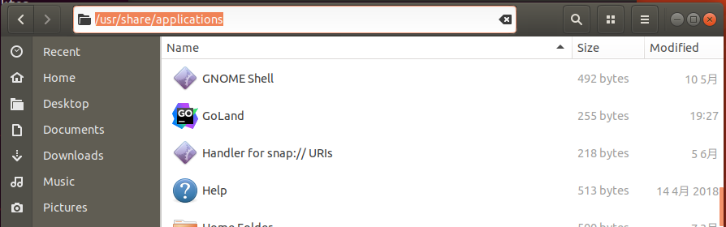

## ubuntu安装go语言

至此，上面的win下安装go就作废了，需要在ubuntu上安装go，过程如下：

1. 先下载安装包 https://golang.google.cn/dl/ ，选择Linux版本的安装包`go1.13.5.linux-amd64.tar.gz`

2. 在下载目录下打开命令行，将安装包解压到目录/usr/local下，

   ```bash
   sudo tar -C /usr/local -xzf go1.4.linux-amd64.tar.gz
   ```

   注意需要事先取得root权限（使用命令su），否则解压时没有权限创建go文件夹。

3. 将 /usr/local/go/bin 目录添加至PATH环境变量：

   ```bash
   export PATH=$PATH:/usr/local/go/bin
   ```

4. 验证安装：

   ```bash
   go version
   ```

   

   安装成功

> 参考菜鸟教程 https://www.runoob.com/go/go-environment.html

## ubuntu安装goland

- go语言全称是golang
- goland是go语言的IDE

安装过程：

1. 下载Linux版的安装包：https://www.jetbrains.com/go/download/#section=linux

2. 进入下载目录，然后将安装包解压到 /usr/local 目录下

   ```bash
   sudo tar -C /usr/local -xzf goland-2019.3.tar.gz
   ```

3. 进入goland安装目录下启动goland

   ```bash
   cd /usr/local/GoLand-2019.3/bin
   sudo ./goland.sh
   ```

   运行bin目录下的goland.sh即可启动程序。

4. Goland并没有自动创建桌面启动的快捷方式，以至于每次想打开goland都要到命令行下面重复这么麻烦的操作，为了方便，我们还要为它创建一个快捷方式。goland打开后点击任务栏：tools---->create desktop entry 

   然后发现桌面并没有出现快捷方式，实际上它把快捷方式生成到目录`/usr/share/applications`下了，打开文件系统，按下 ctrl+l ，输入`/usr/share/applications`去到对应目录下就能看到快捷方式了

   

   把它拖到桌面上即可。


## 用Goland运行简单代码

参考[Goland入门指南（使用Goland创建并运行项目）](http://c.biancheng.net/view/6170.html)

